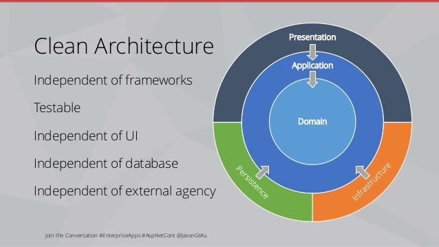

# Python template for development applications following Uncle Bob's Clean Architecture principles.




## Installation
### 1. using docker:
``` shell
docker-compose up
```

### 2. standart installation
1. Create a virtual environment
``` shell
python -m venv .venv
```

2. Activate a virtual environment
``` shell
source .venv/bin/activate
```

3. Install the project dependencies
``` shell
pip install -e .
```

you can also install the dependencies for the development, it's include dependencies for lint, formatting and testing

``` shell
pip install -e .[dev]
```

4. set environment variables following this template
``` shell
DATABASE_URI="required"

SERVER_HOST="default: localhost"
SERVER_PORT="default: 8000"
GUNICORN_WORKERS="default: 4"
```

5. Apply migrations
```
alembic -c conf/alembic.ini upgrade head
```

6. Run the project
``` shell
gunicorn -c conf/gunicorn.conf.py 'app.main.web_api:create_app()'
```

## Architecture concepts

### Domain

> The domain layer contains the code and data specific to the application's subject area. This layer is the most critical part of the application, defining what makes it unique. Sometimes referred to as business logic, the domain layer encapsulates the core functionality and rules of the application.
>
> For example, in an online store, the domain may include entities such as user, product, cart, and order. It would contain the code for creating new users or orders, functions for calculating the total price of the cart and discounts on products, and functions for adding and removing items from the cart.
>
> However, code for database communication or interface rendering does not belong to the domain layer. Such code serves the domain layer by allowing transformed data to be saved in the database or displayed to users.
>
> The domain layer can contain the following components:
>
> - **Entities:** Objects that have a distinct identity that runs through time and different states.
> - **Aggregate Roots:** Entities that act as entry points to aggregates, enforcing consistency rules within the aggregate.
> - **Value Objects:** Objects that describe some characteristic or attribute but have no distinct identity.
> - **Repository Interfaces:** Abstract definitions for accessing aggregates and entities, typically implemented in the infrastructure layer.
> - **Domain Services:** Services that encapsulate domain logic not naturally fitting within an entity or value object.
> - **Domain Events:** Events that capture things that happen in the domain that domain experts care about.
> - **Business Rules:** Specific rules and constraints that enforce the business logic within the domain.
>
> For more on this topic, refer to [Domain-Driven Design](https://martinfowler.com/bliki/DomainDrivenDesign.html).

### Application

> The Application Layer can be considered the epicenter of the project. As its name suggests, it's in this stratum where the application is developed in its tangible form, bringing to life the logic previously defined in the domain layer. In other words, it's the space where use cases are materialized and executed, ultimately defining the application's behavior.
>
> In this layer, I've focused on the following crucial aspects, including:
>
> ### Use Cases
> The Application Layer is where the core logic of the application is concretely implemented. These use cases describe specific scenarios in which the main functionality of the application is used to achieve specific goals.
> 
> ### External Systems
> Although at this stage the application is not directly connected to a database, message broker, event bus, or other external systems, the abstract classes and interfaces that the future infrastructure layer will use to manage interactions with external systems are defined here. This ensures a smooth transition to the infrastructure layer when needed.
> 
> ### Commands/Queries (CQRS)
> If you're using the Command Query Responsibility Segregation (CQRS) pattern, this layer is where commands and queries are defined. Commands represent the operations that change the state of the application, while queries retrieve data without modifying the state. This separation helps in scaling and optimizing performance.
> 
> ### Data Transfer Objects (DTOs)
> DTOs are used in this layer to transfer data between different parts of the application. They encapsulate the data needed by use cases and are crucial for communication between layers, ensuring that only the necessary data is exposed and transferred.
> 
> ### Exceptions
> Handling exceptions in this layer ensures that the application can manage and respond to errors gracefully. Custom exceptions specifLayeric to the application's use cases are defined here to provide meaningful error messages and to maintain the robustness of the application's operations.

### Presentation

> The Presentation Layer in server-side applications is responsible for managing the interactions between the users and the application. This layer focuses on handling HTTP requests, preparing data for the user, and sending HTTP responses. It serves as the intermediary between the client interface and the core application logic.
>
> ### Responsibilities
>
> - **Request Handling:** The Presentation Layer captures and processes incoming HTTP requests. It parses the request data, identifies the required actions, and delegates these actions to the appropriate application components.
> - **Response Generation:** After the application processes a request, the Presentation Layer formats the response data, typically as JSON or HTML, and sends it back to the client.
> - **Input Validation:** It performs initial validation of the data received in HTTP requests to ensure it meets the expected formats and constraints before passing it on to the application logic.
> - **Error Handling:** This layer manages errors that occur during request processing. It translates exceptions and errors into meaningful HTTP responses, often with appropriate status codes and error messages.
> - **Session Management:** It handles user sessions, including authentication and maintaining state across multiple requests.
> 
> ### Components
> 
> - **Controllers/Handlers:** Components that define the endpoints for the application. Each controller or handler corresponds to a specific route or URL pattern and manages the logic for that endpoint.
> - **Request DTOs:** Data Transfer Objects that encapsulate the data received in HTTP requests. They ensure a clear contract for what data the endpoint expects.
> - **Response DTOs:** Objects that structure the data to be returned in HTTP responses. They help in standardizing the output format sent to the clients.
> - **Middlewares:** Intermediary components that process requests and responses. They can perform tasks like logging, authentication, input validation, and more.
> - **View Templates (if applicable):** In applications that render HTML, view templates generate the HTML content. These templates use data provided by the application to produce dynamic web pages.
> 
> ### Interaction with Other Layers
> 
> The Presentation Layer interacts directly with the Application Layer to invoke use cases and execute business logic. It sends data from HTTP requests to the application and receives processed data to include in HTTP responses. This layer may also interact with the Infrastructure Layer indirectly, particularly when dealing with authentication tokens, session data, or other mechanisms that require persistent storage.
> 
> By keeping the concerns of request handling, response generation, and user interaction separate from business logic and data access, the Presentation Layer ensures a clean architecture that is easier to maintain and scale.


### Infrastructure Layer

> The Infrastructure Layer is responsible for providing technical capabilities that support the application's core functionality. This includes handling data persistence, external system integration, and other technical operations that facilitate the execution of the business logic defined in the domain and application layers.
>
> ### Responsibilities
>
> - **Data Persistence:** Manages the storage, retrieval, and update of data in databases. This includes implementing repository interfaces defined in the domain layer.
> - **External System Integration:** Handles communication with external systems such as third-party services, APIs, message brokers, and event buses.
> - **Infrastructure Services:** Provides technical services like logging, caching, configuration management, and other cross-cutting concerns.
> - **Security:** Manages authentication and authorization mechanisms, ensuring secure access to the application and its data.
> - **File Storage:** Handles operations related to file storage and retrieval, whether in local storage or cloud storage solutions.
> 
> ### Components
> 
> - **Repositories:** Concrete implementations of repository interfaces defined in the domain layer. They handle data operations such as querying, saving, and deleting records in the database.
> - **Data Access Objects (DAOs):** Objects that abstract and encapsulate all access to the data source. DAOs manage the connection with the data source to obtain and store data.
> - **APIs and Clients:** Components that interact with external services. This includes HTTP clients, SDKs, and other tools required to communicate with third-party APIs.
> - **Messaging Components:** Components for integrating with messaging systems like message brokers (e.g., RabbitMQ, Kafka) and event buses, facilitating asynchronous communication.
> - **Infrastructure Services:** Services that provide logging, caching, and configuration management. These components ensure that these cross-cutting concerns are handled consistently across the application.
> - **Security Components:** Implementations of security measures including authentication providers, token services, and authorization handlers.
> 
> ### Interaction with Other Layers
> 
> The Infrastructure Layer works closely with both the Application and Domain layers:
> 
> - **Domain Layer:** It implements the repository interfaces and other abstractions defined in the domain layer. This ensures that the domain logic is decoupled from technical details.
> - **Application Layer:** It provides the necessary infrastructure to execute use cases and manage data. For instance, the application layer may call repositories to fetch or persist data and use infrastructure services for logging or caching.
> 
> By abstracting the technical details of data storage, external integrations, and other infrastructure concerns, this layer allows the domain and application layers to focus on business logic and use cases. This separation of concerns enhances the maintainability, testability, and scalability of the application.

### Main

> The Main Layer, sometimes referred to as the Composition Root, is responsible for bootstrapping and configuring the application. This layer initializes the application, wires together all the components, and manages the application's startup and shutdown processes.
>
> ### Responsibilities
>
> - **Application Initialization:** This layer is responsible for setting up the application, including configuring dependency injection, initializing configuration settings, and preparing any necessary infrastructure.
> - **Dependency Injection (DI):** It configures the dependency injection container, registering all the services, repositories, and other components that the application requires.
> - **Configuration Management:** Loads and manages configuration settings from various sources such as files, environment variables, or external configuration services.
> - **Startup Logic:** Contains the logic that needs to run when the application starts, such as seeding databases, starting background services, or performing initial checks.
> - **Shutdown Logic:** Handles graceful shutdown procedures, ensuring that resources are released properly, and any necessary cleanup is performed.
> 
> ### Components
> 
> - **Entry Point:** The main entry point of the application, typically a main method or a startup class that kicks off the application.
> - **DI Container Setup:** Configurations for the dependency injection container, registering all necessary dependencies for the application.
> - **Configuration Providers:** Components that load and provide configuration settings, ensuring that the application has access to necessary configuration data.
> - **Middleware Setup (if applicable):** For web applications, this includes setting up middleware components that handle requests and responses.
> - **Service Initialization:** Logic to initialize services that need to start when the application runs, such as background workers or scheduled tasks.
> - **Application Context:** Establishes the application's context, including setting up global error handling, logging configurations, and other context-specific settings.
> 
> ### Interaction with Other Layers
> 
> The Main Layer interacts with all other layers to ensure that the application is correctly configured and ready to run:
> 
> - **Domain Layer:** It doesn't interact directly with the domain logic but ensures that all domain services and repositories are properly registered and available for injection.
> - **Application Layer:** Initializes the application use cases and services, ensuring they are ready to handle requests and perform operations.
> - **Infrastructure Layer:** Configures and initializes infrastructure components such as database connections, logging services, and external system integrations.
> - **Presentation Layer:** For web applications, sets up the web server, routes, and middleware needed to handle incoming requests.
> 
> By centralizing the application's setup and configuration, the Main Layer ensures a clean and maintainable approach to managing the application's lifecycle. It allows for easy modifications to the application's startup logic and provides a clear entry point for understanding how the application is assembled.

## Contact
If you have any questions, suggestions, or feedback regarding this project, feel free to contact the author:

- **Author:** Alim Abrekov
- **Email:** Abrekovalim38702@gmail.com
- **GitHub:** [https://github.com/Dark04072006](https://github.com/Dark04072006)
- **Telegram:** [https://t.me/some_usernamexD](https://t.me/some_usernamexD)
